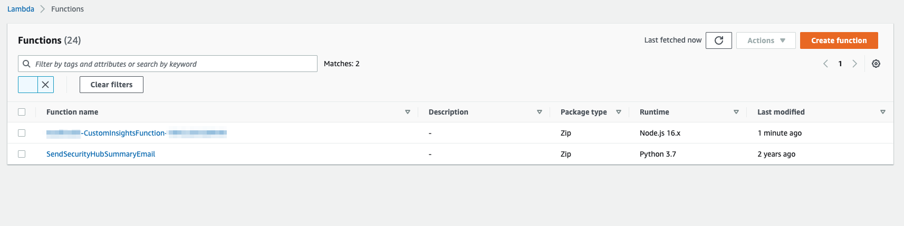

## How to Setup a Recurring Security Hub Summary Email

This solution uses Security Hub custom insights, AWS Lambda, and the Security Hub API. A custom insight is a collection of findings that are aggregated by a grouping attribute, such as severity or status. Insights help you identify common security issues that may require remediation action. Security Hub includes several managed insights, or you can create your own custom insights.  

### Overview
A recurring Security Hub Summary email will provide recipients with a proactive communication summarizing the security posture and improvement within their AWS Accounts.  The email message contains the following sections:

- AWS Foundational Security Best Practices findings by status
- AWS Foundational Security Best Practices findings by severity
- Amazon GuardDuty findings by severity
- AWS IAM Access Analyzer findings by severity
- Unresolved findings by severity
- New findings in the last 7 days by security product 
- Top 10 resource types with the most findings

### Here’s how the solution works
1.	Seven Security Hub custom insights are created when the solution is first deployed.
2.	A CloudWatch time-based event invokes a Lambda function for processing.
3.	The Lambda function gets results of the custom insights from Security Hub, formats the results for email and sends a message to SNS.
4.	SNS sends the email notification to the address provided during deployment.
5.	The email includes the summary and links to the Security Hub UI to follow the remediation workflow.


### Deployment Steps

1.	Download the CloudFormation template **security-hub-email-summary-cf-template.json** and zip file named **sec-hub-email.zip**

2. Copy security-hub-email-summary-cf-template.json and sec-hub-email.zip **to an S3 bucket within your target AWS account** and region.  Copy the object URL for the CloudFormation template json file.

3. On AWS account console, open the service **CloudFormation**. Click on **Create Stack** with new resources.

4.	Enter the S3 Object URL for the security-hub-email-summary-cf-template.json which you uploaded in step 1 in the text box for Amazon S3 URL under Specify template.

5.	Click on **Next**. On next page, enter a name for the stack.

6.	On the same page, enter values for the input **parameters**. 

7.	Click **Next**.

8.	Accept all defaults in screens that follow and create the stack. Click **Next**.

9.	**Check** I acknowledge that AWS CloudFormation might create IAM resources. Click **Create Stack**.

### Test Solution
You can send a test email once the deployment is complete and you have confirmed the SNS subscription email.  Navigate to the Lambda console and locate the function Lambda function named SendSecurityHubSummaryEmail.  Perform a [manual invocation](https://docs.aws.amazon.com/lambda/latest/dg/getting-started-create-function.html#get-started-invoke-manually) with any event payload to receive an email shortly. 

## Security

See [CONTRIBUTING](CONTRIBUTING.md#security-issue-notifications) for more information.

## Lambda Node.js version update from 12 to 16
The sample code in this repo creates two Lambda functions when deployed: CustomInsightsFunction (Node.js) and SendSecurityHubSummaryEmail (Python). The CustomInsightsFunction (Node.js) function is a CloudFormation custom resource used to create the Security Hub custom insights and is intended to only run once during initial deployment.  

If you received the below email regarding the End-Of-Life for Node.js 12 you update the CloudFormation stack with the latest [security-hub-email-summary-cf-template.json](security-hub-email-summary-cf-template.json) to resolve.

### CloudFormation Stack Update Steps
1.	Download the latest security-hub-email-summary-cf-template.json in this repo.
2.	Navigate to the CloudFormation console and locate your existing deployment stack. The stack description says “Security Hub Weekly Summary. Sends email”
3.	Click Update
4.	Replace Current Template
5.	Select upload a template file.  Select the updated template downloaded in step 1
6.	No changes are needed in Parameters or Options
7.	Check the box for “I acknowledge that AWS CloudFormation might create IAM resources.”
8.	Click Update Stack
9.	Navigate to Lambda console and validate Runtime version Node.js 16x for CustomInsightsFunction



### Email - [Action Required] AWS Lambda end of support for Node.js 12

``` Hello,

We are contacting you as we have identified that your AWS Account currently has one or more Lambda functions using Node.js 12 runtime.

We are ending support for Node.js 12 in AWS Lambda. This follows Node.js 12 End-Of-Life (EOL) reached on April 30, 2022 [1].

As described in the Lambda runtime support policy [2], end of support for language runtimes in Lambda happens in two stages. Starting November 14, 2022, Lambda will no longer apply security patches and other updates to the Node.js 12 runtime used by Lambda functions, and functions using Node.js 12 will no longer be eligible for technical support. In addition, you will no longer be able to create new Lambda functions using the Node.js 12 runtime. Starting December 14, 2022, you will no longer be able to update existing functions using the Node.js 12 runtime.

We recommend that you upgrade your existing Node.js 12 functions to Node.js 16 before November 14, 2022.

End of support does not impact function execution. Your functions will continue to run. However, they will be running on an unsupported runtime which is no longer maintained or patched by the AWS Lambda team.

The following command shows how to use the AWS CLI [3] to list all functions in a specific region using Node.js 12. To find all such functions in your account, repeat this command for each region:

aws lambda list-functions --function-version ALL --region us-east-1 --output text --query "Functions[?Runtime=='nodejs12.x'].FunctionArn"

If you have any concerns or require further assistance, please contact AWS Support [4].

[1] https://nodejs.org/en/blog/release/v12.22.12/
[2] https://docs.aws.amazon.com/lambda/latest/dg/runtime-support-policy.html
[3] https://aws.amazon.com/cli/
[4] https://aws.amazon.com/support

Sincerely,
Amazon Web Services
```

## License

This library is licensed under the MIT-0 License. See the LICENSE file.

