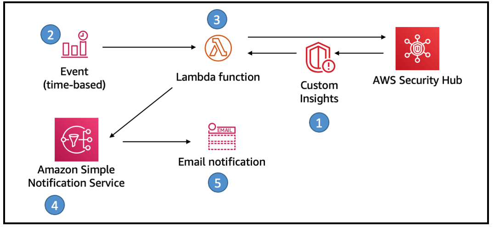

## How to Setup a Recurring Security Hub Summary Email

This solution uses Security Hub custom insights, AWS Lambda, and the Security Hub API. A custom insight is a collection of findings that are aggregated by a grouping attribute, such as severity or status. Insights help you identify common security issues that may require remediation action. Security Hub includes several managed insights, or you can create your own custom insights.  

Setup weekly email notifications to account owners with a summary of the existing security findings to prioritize, new findings, and links to the Security Hub console for more information. 

### overview
A recurring Security Hub Summary email will provide recipients with a proactive communication summarizing the security posture and improvement within their AWS Accounts.  The email message contains the following sections:

- AWS Foundational Security Best Practices findings by status
- AWS Foundational Security Best Practices findings by severity
- Amazon GuardDuty findings by severity
- AWS IAM Access Analyzer findings by severity
- Unresolved findings by severity
- New findings in the last 7 days by security product 
- Top 10 resource types with the most findings

### Here’s how the solution works:
1.	Seven Security Hub custom insights are created when the solution is first deployed.
2.	A CloudWatch time-based event invokes a Lambda function for processing.
3.	The Lambda function gets results of the custom insights from Security Hub, formats the results for email and sends a message to SNS.
4.	SNS sends the email notification to the address provided during deployment.
5.	The email includes the summary and links to the Security Hub UI to follow the remediation workflow.

### Deployment Steps

1.	Download the CloudFormation template **security-hub-email-summary-cf-template.json** and zip file named **sec-hub-email.zip**

2. Copy security-hub-email-summary-cf-template.json and sec-hub-email.zip **to an S3 bucket within your target AWS account** and region.  Copy the object URL for the CloudFormation template json file.

3. On AWS account console, open the service **CloudFormation**. Click on **Create Stack** with new resources.

4.	Enter the S3 Object URL for the security-hub-email-summary-cf-template.json which you uploaded in step 1 in the text box for Amazon S3 URL under Specify template.

5.	Click on **Next**. On next page, enter a name for the stack.

6.	On the same page, enter values for the input **parameters**. 

7.	Click **Next**.

8.	Accept all defaults in screens that follow and create the stack. Click **Next**.

9.	**Check** I acknowledge that AWS CloudFormation might create IAM resources. Click **Create Stack**.

### Test Solution
You can send a test email once the deployment is complete and you have confirmed the SNS subscription email.  Navigate to the Lambda console and locate the function Lambda function named SendSecurityHubSummaryEmail.  Perform a [manual invocation](https://docs.aws.amazon.com/lambda/latest/dg/getting-started-create-function.html#get-started-invoke-manually) with any event payload to receive an email shortly. 

## Security

See [CONTRIBUTING](CONTRIBUTING.md#security-issue-notifications) for more information.

## License

This library is licensed under the MIT-0 License. See the LICENSE file.

